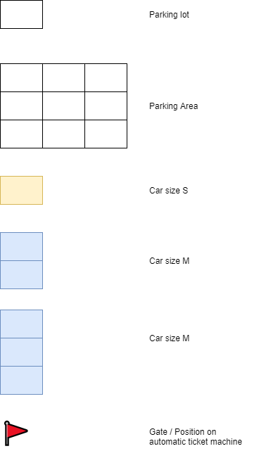

# Automated Ticketing System

A web API for create parking, check-in to park, check-out to leave and show parking status for example available lot for
car by size (small, medium and large)

# Environments

```text
AUTO_TICKET_SYSTEM_DB_HOST
AUTO_TICKET_SYSTEM_DB_USER
AUTO_TICKET_SYSTEM_DB_PASS
AUTO_TICKET_SYSTEM_DB_PORT
AUTO_TICKET_SYSTEM_DB_NAME
```

# Scripts

```shell
# Start stack
docker-compose up

# Start development
yarn start:dev

# Unit test
yarn test

# Coverage test
yarn test:cov
```
# Assumption
## Annotation


## Condition

- Parking lot has unique Lat and Long
- Gate / Automatic Ticket Machine has Lat 0 and Long 0
- Any car will to parking must check in at the Gate
- A car size S use 1 parking lot
- A car size M use 2 parking lot
- A car size L use 3 parking lot
- The automatic ticket machine will create a ticket and select short distance parking lot for your car size (see Example 1)
- When car leave parking lot then parking lot will available for next car
- Have a few available parking lot but no slot support that car size the ticket machine will not create a ticket (see Example 2) 

### Example 1
Parking lot Lat 1, Long 1 unavailable. Next, A car size M come to park that the ticket machine will create a ticket and select parking lot Lat 0 Long 2 and Lat 1 Long 2 for this car


### Example 2
Parking lot (0,1), (1,2) and (2,3) unavailable. Next, A car size L come to park. the ticket machine will not create a ticket


# Getting Started
**1.** Start Automated Ticketing System with ``docker-compose up --build``

**2.** Import Postman collection with [postman_auto-ticket-system.json](postman_auto-ticket-system.json)

**3.** Create parking lot area by POST request to http://auto-ticket-system-api/parking-lot-stage with body JSON like this

```json
{ 
  "size": "3" // 3, 4, square3
}
```

or use postman collection: _Create parking lot_
   


**4.** Create ticket by POST request to http://auto-ticket-system-api/ticket with JSON body like this

```json
{
  "size": "s" // s, m, l
}
```
or use postman collection: _Create ticket_

**5.** Leave parking lot by PUT request to http://auto-ticket-system-api/ticket/leave/your-ticket-id or use postman collection: _Leave parking lot_

**6.** Get parking lot status by GET request to http://auto-ticket-system-api/parking-lot-stage/status or use postman collection: _Get parking lot status_. Example response

```json
{
    "subject": "Parking lot status",
    "capacity": 9, // parking lot size
    "parking": {
        "small": 1, // total car size S parking
        "medium": 2, // total car size m parking
        "large": 0, // total car size L parking
        "total": 3 // count all car parking
    },
    "available": {
        "small": 4, // available parking lot for car size S from available slot
        "medium": 1, // available parking lot for car size M from available slot
        "large": 1 // available parking lot for car size L from available slot
    }
}
```

7.Search licence plate by car size by GET request to http://auto-ticket-system-api/report/licence-plate?size=s or use postman collection: _Search licence plate by car size_

```text
# s, m, l, all (default)
?size=s
```

8.Get parking lot available by car size
